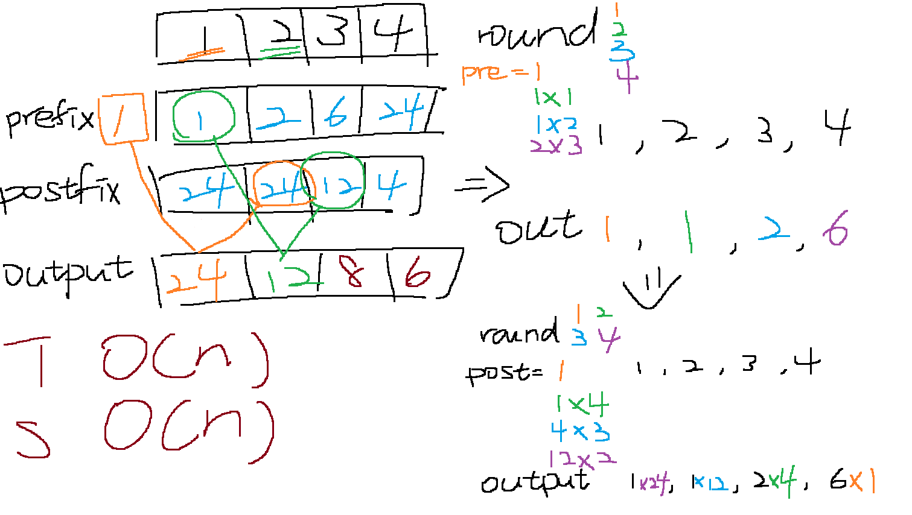

# 238. Product of Array Except Self
## UMPIRE
### Understand 

- Because we need to solve it in O(n), we cannot use double loop to solve.
- The input will be empty?
    - No, the input has two number at least.

### Match 
- array and hashing

### Plan
General Idea : Calculate the product befroe the index and after the index, then multiply them together

1. Initialize a vector called `answer` of the same size as `nums`, filled with 1s
2. Calculate Prefix Products :
    1. initialize `prefix` to store the product before the element frist
    2. traverse the array from left to right
    3. For each element, update `answer[i]` by multiplying it with `prefix`
    4. Then, update `prefix` by multiplying it with `nums[i]`
3. Calculate Postfix Products :
    - initialize `postfix` to store the product after the element
    - traverse the array from right to left
    - update `answer[i]` by multiplying it with `postfix`
    - Then, update `postfix` by multiplying it with `nums[i]`
4. Return `answer`

### Implement
see sol.cpp

### Review

### Evaluate
- Time Complexity : O(n), which `n` is length of array

- Space Complexity : O(n), which `n` is length of `answer`

- Pros
    - efficiency
- Cons
    - Requires careful handling of indices during computation