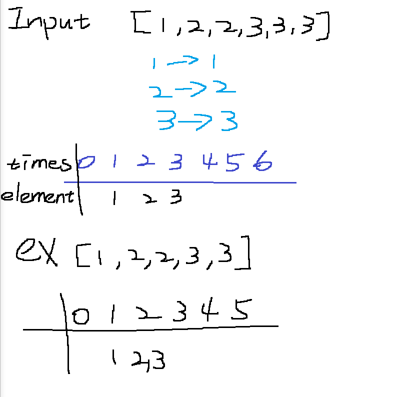

# 347. Top K Frequent Elements
## UMPIRE
### Understand
- To cakculate the elements' frequency in the given array and return the top k most frequent elements.

### Match
- array and hashing

### Plan
1. **Count Frequencies**:
   - Iterate through the array and use an `unordered_map<int, int>` to count the frequency of each element.
2. **Bucket Sort**:
   - Create a `vector<vector<int>>` where the index represents the frequency, and store elements with that frequency in the corresponding vector.
3. **Extract Top `k` Elements**:
   - Iterate through the frequency vector from the end to the beginning to collect the top `k` most frequent elements.

### Implement
see sol.cpp

### Review

### Evaluate
- Time Complexity:
    - Counting frequencies: 
        O(n), where n is the number of elements in nums.
    - Building frequency buckets: O(n).
    - Extracting top k elements: In the worst case, iterating through the freq vector could be O(n), but usually this step is quicker since k is much smaller than n.
    - Overall: O(n) (average case).

- Space Complexity:
    - Space for unordered_map: O(n).
    - Space for vector<vector<int>> freq: O(n).
    - Space for result vector: O(k).
    - Overall: O(n).

- Pros:
    - Efficient with O(n) time complexity on average.
    - Uses bucket sort, which is well-suited for this problem since it directly leverages frequency counts.

- Cons:
    - Additional space for the freq vector and the unordered_map may be significant if n is very large.
    - If k is very small compared to n, the space used for freq may be excessive, but this is usually not a major issue.