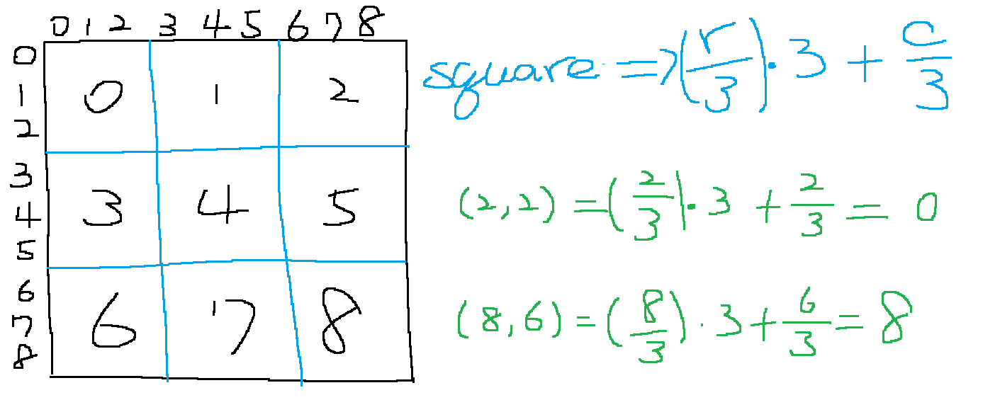

# 36. Valid Sudoku
## UMPIRE
### Understand

- no need to assume the value of a blank spot and if it is solvable

### Match
- array and hashing

### Plan
General Idea : to see if a element appears in row, in colume and 3x3 square

- Initializing three unordered_map<int, unordered_set<char>> hash maps for columns, rows, and 3x3 squares.
- traverse every elements
   - if element is `.`, continue
   - if element appears in row or in column or in square, return `false`
   - insert the value into three hash map(columns, rows, squares)
- return `true`, if no duplicates are found.

### Implement
see sol.cpp

### Review

### Evaluate
- Time Complexity : O(81) = O(1), cause fixed-size board
- Space Complexity : O(81) = O(1), cause fixed-size board
- pros : 
   - simplicity
   - efficiency
- cons : 
   - memory usage
   - not generic
   - potential hash collisions