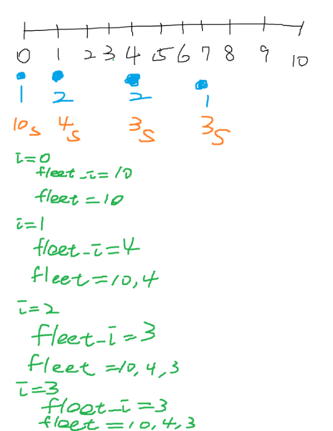

# Car Fleet
## UMPIRE
### Understand

### Match
- Stack

### Plan

### Implement
see sol.cpp

### Review

### Evaluate
- Time Complexity : O(nlogn), `n` is size of position or speed

- Space Complexity : O(n), `n` is numbers of car

- Pros

- Cons