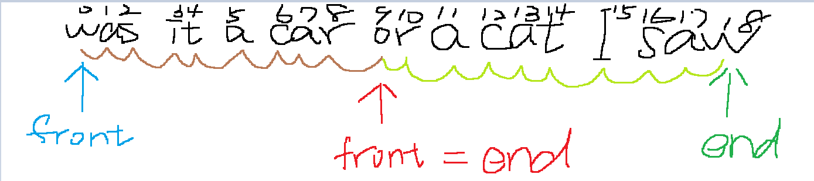

# 125. Valid Palindrome
## UMPIRE
### Understand

1. Can the input string be empty?
    Yes, and the result should be `true`
2. Any requirement on time/space complexity?
    Solve in O(1) space complexity
3. Does removing all non-alphanumeric characters means only ASCII character should be consindered?
    Yes

### Match
- Two pointers

### Plan
General Idea : Using two pointers to compare from two ends

1. Initialize `front` with `0` and `end` with `length - 1`, where `length` is the size of the string `s`.

2. While `front` is less than `end`:
   1. If the character at `front` is not alphanumeric, increment `front` and continue to the next iteration.
   2. If the character at `end` is not alphanumeric, decrement `end` and continue to the next iteration.
   3. If the lowercase version of the character at `front` is not equal to the lowercase version of the character at `end`, return `false` (the string is not a palindrome).
   4. Increment `front` and decrement `end`.

3. If the loop completes without returning `false`, return `true` (the string is a palindrome).

### Implement
see sol.cpp

### Review

### Evaluate
- **Time Complexity**:
  - The time complexity is **O(n)**, where `n` is the length of the string `s`.

- **Space Complexity**:
  - The space complexity is **O(1)**. The algorithm uses a constant amount of extra space for the `front` and `end` pointers, and does not require additional data structures.

- **Pros**:
  - **Efficiency**: The algorithm runs in linear time, which is optimal for this problem.
  - **Space Efficiency**: It uses a constant amount of extra space, making it suitable for situations with limited memory.
  - **Simplicity**: The approach is straightforward and easy to understand. It combines character filtering and comparison in a single loop.

- **Cons**:
  - **Readability**: The use of `continue` statements and inline checks might be slightly harder to follow for some readers compared to a more segmented approach.
  - **Character Case Handling**: Converts characters to lowercase for comparison, which might be less efficient than checking character cases if the character set is large.
