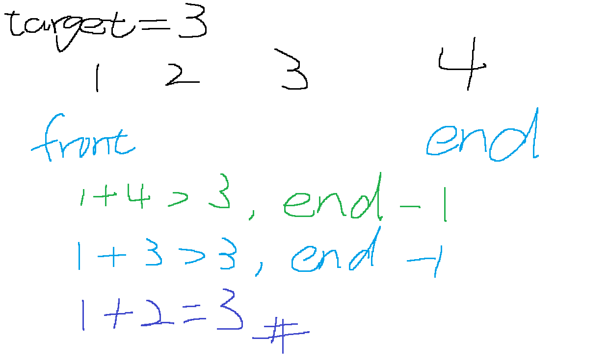

# 167. Two Sum II - Input Array Is Sorted
## UMPIRE
### Understand

### Match
- two pointers
### Plan
1. Initialize two pointers: `front` at the start of the array, `end` at the end.
2. Use a while loop with the condition `front < end`.
3. In each iteration:
   a. Calculate `numbers[front] + numbers[end]`.
   b. If the sum equals the target, return `{front+1, end+1}` (note: the problem requires 1-based indexing).
   c. If the sum is greater than the target, move `end` to the left (to decrease the sum).
   d. If the sum is less than the target, move `front` to the right (to increase the sum).
4. If the loop ends without finding a solution, return an empty vector (although the problem guarantees a solution).
### Implement
see sol.cpp

### Review

### Evaluate
- Time Complexity:
   - O(n), where `n`is the length of the array.
   - In the worst case, we may need to traverse the entire array once.

- Space Complexity:
   - O(1), as we only use two pointer variables regardless of the input size.

- Pros:
   - Efficient solution with linear time complexity.
   - Utilizes the sorted nature of the array effectively.
   - Handles edge cases well (e.g., avoiding self-comparison).
   - Easy to implement and understand.
   - Suitable for large datasets due to its efficiency.

- Cons:
   - Only works on sorted arrays; requires pre-sorting for unsorted inputs.
   - Not easily adaptable for finding more than two numbers.
   - Doesn't optimize for scenarios with many duplicate elements.
   - Requires index adjustment when returning the result.
   - Cannot terminate early if no solution exists (though problem guarantees a solution).